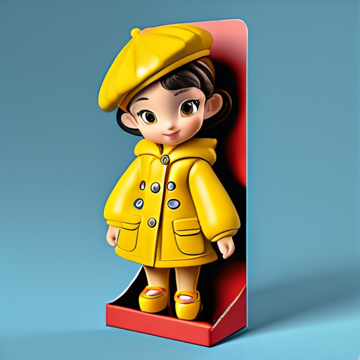
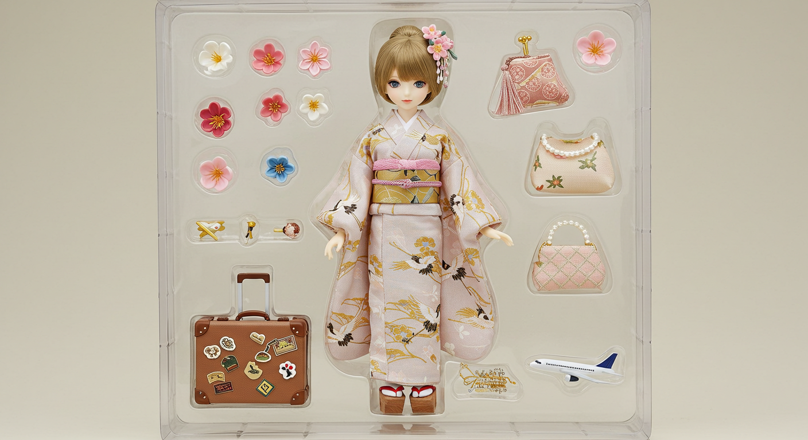

# 🎯 Prompt Engineering Portfolio

Showcase my prompts studying journey.
Welcome to my AI Prompt portfolio! Here are some Prompt examples I designed for different tasks, combining creativity and structure, ranging from ChatGPT dialogue design to AI image generation.

---

## 📂 Categories

 Category | Description | Preview
|------|------|-----------|
| 🖼️ [Image Generation prompt: Stable Difussion](image_generation/stable_diffusion/README.md) | Stable Difussion Visual Creation: 3D Toy Texture |  |
| 🖼️ [Image Generation prompt: Google Image FX](image_generation/image_fx/README.md) | Google Image FX Visual Creation: TS inspired doll |  |
| 🖼️ [Image Generation prompt: DALL·E](image_generation/DALLE/README.md) | DALL·E Visual Creation |  Coming soon 🔨|
| 👔 [Business: HR & Recruitment prompts](business_hr_recruitment/README.md) | Human Resources Recruitment Assistance |👉🤖 [HR Prmopts Output Examples](business_hr_recruitment/examples.md) 👈|
| 📝 [Marketing Content prompt](marketing_content/README.md) | AI‑powered expansion for posts, emails, blogs, CTA & multilingual copy |👉🤖 [Marketing Prompts Output Examples](marketing_content/mktoutput.md) 👈|
| 🧠 [Idea Generation prompt](idea_generation/README.md) | Idea generation assistance, inspiration burst |  Coming soon🔨| 
| 🤖 [Chatbot Design prompt](chatbot_design/README.md) | ChatGPT Dialogue Design and Personality Construction |  Coming soon🔨| 

---

## ✨ My design concept

- Visual presentation: Attach pictures and sample results to facilitate understanding and presentation of results
- Focus on goal orientation: Each prompt has a clear goal and output expectation
- Step-by-step optimization: using techniques like `Chain of Thought`, `Few-shot`, `System Prompt`, etc.

---

## 🙋‍♀️ About me

A Prompt Engineer / AI Designer who is passionate about creative applications and language structure, currently focusing on cross-modal applications and generative content design.

---

## 🧭 Code of Conduct

Please refer to our [Code of Conduct](prompts/CODE_OF_CONDUCT.md) to ensure a safe and respectful collaboration environment.

---

## 📄 License

This repository is licensed under the [MIT License](./LICENSE), allowing both personal and commercial usage.
